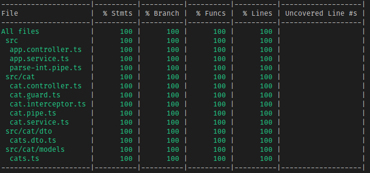

  

# Complex Sample

So, this really is more of an intermediately complex example, as it only scratches the surface of getting into a lot of mocking. The test classes give this project 100% statement, line, branch, and function coverage, and also has all E2E tests passing with both mocking and non mocking examples.

## Hangups

I will admit that the interceptor is not mocked in the E2E test, as I was having trouble figuring out how to correctly mock it so that the data given would work out as expected. The Unit Test for the interceptor does show how mocking can be achieved for line coverage.

### UPDATE

Interceptor mocking is now added in to show it _is_ possible and _easy_ to do!

## Acknowledgements

We created our own ParseIntPipe even though Nest provides one just to show how to go about testing with multiple pipes. This is absolutely not necessary and only done in the scope of this example, normally you should use given tools if you trust the authors.

## Future Additions

Filters can be added in the future to make for even better example of tests.
