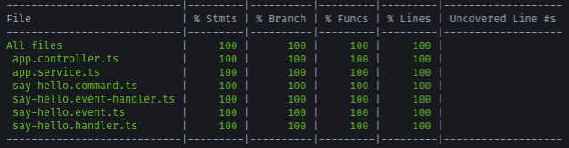

  

# CQRS Sample

Small disclaimer here: I'm not the most well versed when it comes to CQRS and how it all works. With that said, from following [NestJS's Documentation](https://docs.nestjs.com/recipes/cqrs), I've put together a super simple repository and example.
