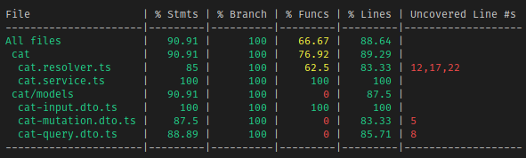

<p align="center">
  
</p>

# GraphQL-Sample

## About the Coverage

You'll notice that the Test coverage for the this application is unlike the others. Due to using `type-graphql` and the necessity to use functions to determine metatypes for the GraphQL server, it becomes difficult to test every possible function. There are ways to mitigate this, such as defining all of these anonymous functions in their own files and testing them directly. An example of that file could look like

```ts
import { Int } from 'type-graphql';

export const returnString = () => String;
// For @Args() decorator
export const typeString = () => String;
export const typeInt = () => Int;
export const typeBoolean = () => Boolean;
export const typeStrings = () => [String];

export const nullable = { nullable: true };
```

## E2E Testing

E2E testing with GraphQL is done just like it is with REST, importing the `AppModule`, and using `supertest` to run REST calls using GraphQL REST syntax. You could also integrate a GraphQL client instead of `supertest` if you wanted, but this repository does not show that.
