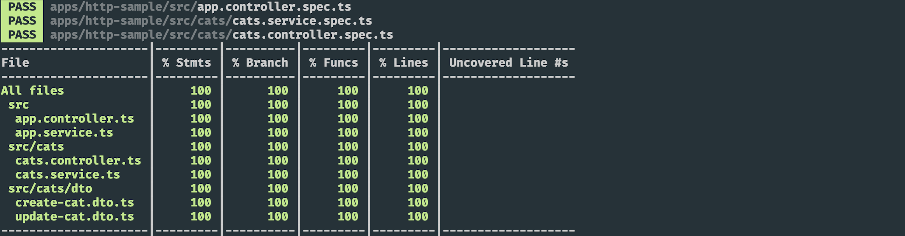

 <p align="center">
  
</p>

# Http Sample

Welcome to the example of using the Http module with Nest and running tests! I decided to use a very simple Http client application with the use of observables, while creating a fake server I used the package [json-server](https://github.com/typicode/json-server). By creating a cats.json file such as this:

```
{
     "cats": [
       {
         "id": 1,
         "name": "Test Cat # 1",
         "age": "5",
         "breed": "Russian Blue"
       },
       {
         "name": "Test Cat # 2",
         "age": "10",
         "breed": "Russian",
         "id": 2
       },
       {
         "id": 3,
         "name": "Test Cat # 3",
         "age": "3",
         "breed": "Russian"
       }
     ]
   }

```
Not much more to say except I hope this is found useful for the community!