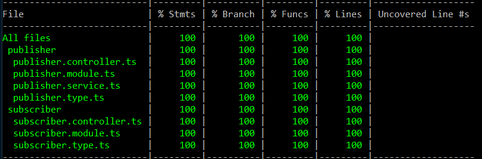

<p align="center">
  
</p>

# Microservice Sample

- Use unit test to test the behavior of an module

```bash
npm run test:cov -- microservice-sample
```

- Using e2e test to simulate the actual interactions of multiple microservices.

```bash
npm run test:cov -- --config ./apps/microservice-sample/jest-e2e.json --runInBand
```
