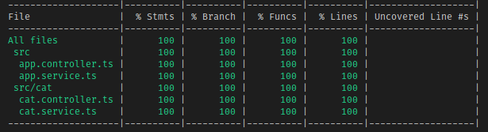

  

# Mongo Sample

Welcome to the example of using MongoDB with Nest and running tests! My _second favorite_ topic! I decided to go with a very simple CRUD application for a single database object, but if there is enough of a demand I will extend this out to a larger repository with more objects and options. Not much else to say other than I hope this is found as helpful to the community!

## Side Note

For this application, I have added a side package called `@golevelup/nestjs-testing` (name subject to change) to help with mocking Repository objects without needing to create the entire mock on your own. I did run into a few issues with the library this time around, namely matching mocks to mocks, so that's something I'll need to work on updating in the future. In the meantime, enjoy the tests!
