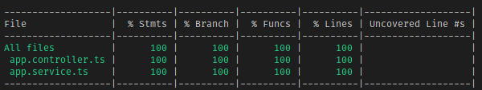

  

# Rendering Sample

All right, gonna admit, I had to use a trick to get the front end to render properly by putting the views directory at root so that it would have the same relative path in the monorepo. Usually, that shouldn't be the case but, oh well, it works. Also, you'll notice I've given the controller a very basic test and did not worry about mocking in the unit test. This is partially because I've already shown unit test mocking _so_ much **and** due to the fact that this testing module is more to show how to work with the e2e tests. Got a problem with it? Please make a PR to update it.

## E2E Testing Notes

The app type **must** be set to `NestExpressApplication` or `NestFastifyApplication` in order to allow yourself to set the views directory and engine correctly. Otherwise, testing follows as normal. Getting a snapshot of your html may be a nice idea to keep the tests thin and easy to read.
