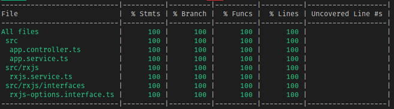

  

# RxJS Sample

Okay, so [RxJS](https://rxjs-dev.firebaseapp.com/guide/overview) is a very complex topic that is difficult to approach in many situations. This sample is as much of an example for you as it is practice for me. I'm going to do my best to show how to test some RxJS utilities as NestJS does make use of RxJS in interceptors and in the HttpService (though you can change that to promises if you don't feel comfortable with RxJS).

## Disclaimer

There's so many different ways to work with and use RxJS that it's really _really_ hard to say what should be done for testing. There's the approach of creating an Observer to emit what you expect, there's [marble testing](https://rxjs-dev.firebaseapp.com/guide/testing/marble-testing), and there's just using a simple creation operator like `interval`. I don't plan to go through all of these initally, but if the demand is high enough I'll show examples of all.
