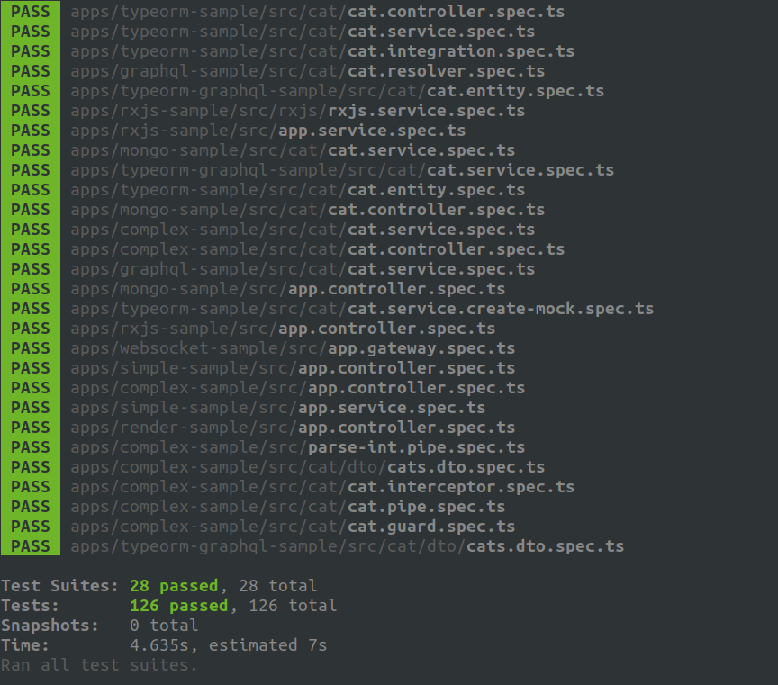

<p align="center">
  
</p>

# TypeORM Sample

Welcome to the example of using TypeORM with Nest and running tests! Everyone's _favorite_ topic! I decided to go with a very simple CRUD application for a single database object, but if there is enough of a demand I will extend this out to a larger repository with more objects and options. Not much else to say other than I hope this is found as helpful to the community!

## Side Note

For this application, I have added a side package called `@golevelup/nestjs-testing` (name subject to change) to help with mocking Repository objects without needing to create the entire mock on your own. You can find this [specific use here](./src/cat/cat.service.create-mock.spec.ts).

## Cat Integration Test Setup

In order to run the `cat.integration.spec.ts` test, you must install PostgreSQL locally on your machine. Once installed, run postgres and create a new user.

For this test, the credentials are as follows:

```
user: rm
password: root
```

You can execute this command to create a new user in pg:

```
CREATE USER rm WITH PASSWORD root;
```

Once a user is created, it's time to create a database in order to run the test. To do so, execute the following commands in postgres:

```
drop database cat_test_db;
create database cat_test_db;
GRANT ALL PRIVILEGES ON DATABASE "cat_test_db" to rm;
```

Before running the tests, make sure that the following environment variables are set in your shell `.rc` file:

```
POSTGRES_USER: rm
POSTGRES_PASSWORD: root
POSTGRES_DB: cat_test_db
POSTGRES_HOST: localhost
POSTGRES_PORT: 5432
```
