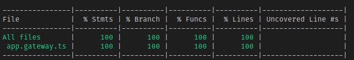

  

# WebSocket Sample

All right, here is a _super_ simple sample of testing a websocket NestJS server (including e2e test). Feel free to add to it and making it more complex, but most of the other repositories go over some of the more complex ideas. This is just to show how to test the websocket message handler, and how to e2e test it. Happy hacking :).
