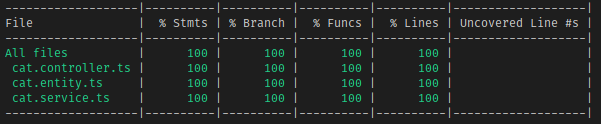

  

# TypeORM Sample

Welcome to the example of using TypeORM with Nest and running tests! Everyone's _favorite_ topic! I decided to go with a very simple CRUD application for a single database object, but if there is enough of a demand I will extend this out to a larger repository with more objects and options.

## Closing Remarks

Do note that while the non-mocked E2E test looks cleaner and easier to deal with, it is also a lot more prone to breaking as it very closely depends on the logic implemented in the CatsService. If that logic changes, the test will fail, while for the most part, the mocked variant will pass. Just as in the unit tests, it is possible to get each provider individually so that you can mock in each function as your heart desires. _(Note to self: I should add that in)_
